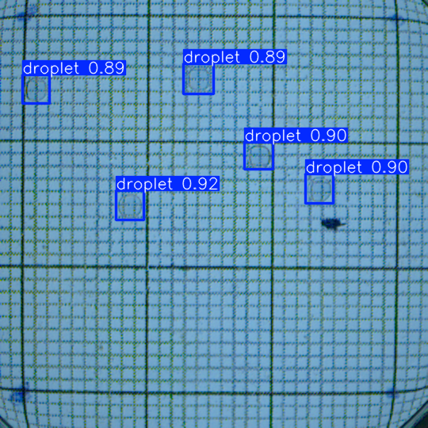
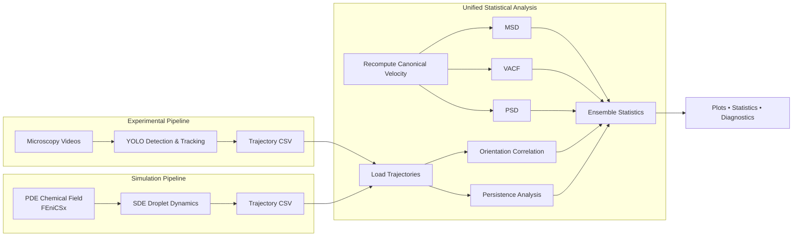
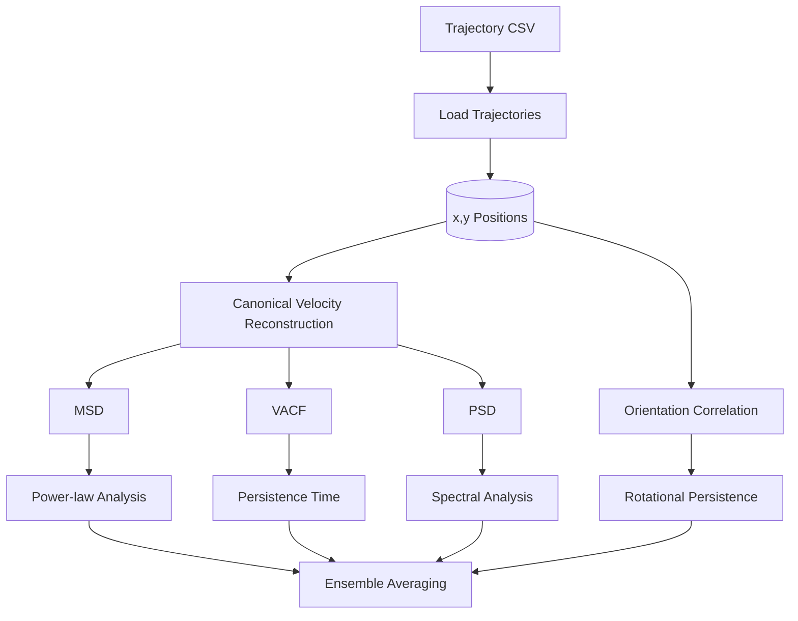
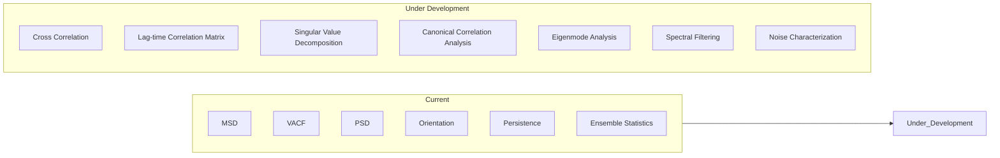

# Memory-Driven Dynamics of Self-Propelled Droplets

<p align="center">
  
</p>

<p align="center">

**Physics-Informed Simulation • YOLO Tracking • Statistical Analysis • Active Matter**

</p>

<p align="center">


</p>

---

## Overview

This repository provides a unified computational framework for studying **memory-driven self-propelled active droplets** from both **experimental microscopy videos** and **physics-based numerical simulations**.

The project integrates

- **YOLO-based droplet detection and tracking**
- **FEniCSx PDE–SDE simulations**
- **Unified statistical trajectory analysis**
- **Visualization and diagnostic tools**
- **Reproducible computational workflows**

Both experimental and simulated trajectories share the **same CSV format**, allowing every statistical analysis routine to be applied without modification.

---

# Overall Pipeline



---

# Repository Structure

```text
.
├── analysis/
│   ├── MSD
│   ├── VACF
│   ├── PSD
│   ├── Orientation
│   ├── Persistence
│   ├── Plotting
│   └── Utilities
│
├── simulation/
│   ├── PDE Solver
│   ├── SDE Integrator
│   └── CSV Export
│
├── tracking/
│   ├── YOLO Detection
│   ├── Object Tracking
│   └── CSV Export
│
├── docs/
│   ├── Architecture
│   ├── Theory
│   ├── API
│   └── Images
│
└── output/
```

---

# Quick Start

```python
from main import DropletPipeline

pipeline = DropletPipeline()

# Analyze existing trajectory CSVs
pipeline.run_analysis(
    base_dir="output_droplet_tracking/csv_files",
    output_dir="./output",
    dt=0.2
)

# Run experimental tracking
pipeline.run_tracking(
    output_dir="output_droplet_tracking"
)

# Run numerical simulation
pipeline.run_simulation()
```

---

# Analysis Workflow




---

# Implemented Features

## Experimental Pipeline

- YOLO object detection
- Multi-object tracking
- Automatic trajectory extraction
- CSV generation

---

## Simulation Pipeline

- Coupled PDE–SDE model
- FEniCSx finite-element solver
- Euler–Maruyama stochastic integration
- Memory-driven active droplet dynamics
- Trajectory export

---

## Statistical Analysis

Current analyses include

- Mean Squared Displacement (MSD)
- Local MSD exponent
- Velocity Autocorrelation Function (VACF)
- Orientation Correlation Function
- Power Spectral Density (PSD)
- Translational persistence time
- Rotational persistence time
- Ensemble averaging
- Statistical visualization

---

# Current Development

The statistical analysis module is actively being expanded to investigate correlated and memory-driven dynamics using advanced multivariate techniques.



Current research focuses on

- Cross-correlation between droplet trajectories
- Lag-time correlation matrices
- Eigenvalue and eigenvector analysis
- Singular Value Decomposition (SVD)
- Canonical Correlation Analysis (CCA)
- Dominant correlation modes
- Improved ensemble statistics
- Spectral filtering
- Statistical inference for memory-driven dynamics

---

# Documentation

## 📄 Complete Report

The project report provides the theoretical background, numerical methods, implementation details, and statistical analyses used throughout the repository.

**Report**

https://github.com/panda-yoo/Memory-Driven-Dynamics-of-Self-Propelled-Droplets---Report-and-Presentation/blob/main/report/main.pdf

---

## 🎓 Presentation

Project presentation slides

https://github.com/panda-yoo/Memory-Driven-Dynamics-of-Self-Propelled-Droplets---Report-and-Presentation/blob/main/presentation/main.pdf

---

# Documentation Index

| Document | Description |
|-----------|-------------|
| Project Structure | Repository organization |
| Dependency Graph | Module dependencies |
| Data Flow | End-to-end workflow |
| MSD | Theory & implementation |
| VACF | Theory & implementation |
| Orientation | Theory & implementation |
| PSD | Theory & implementation |
| Persistence | Translational & rotational persistence |
| Diagnostics | Ensemble consistency |
| Tracking Pipeline | YOLO workflow |
| Simulation | PDE–SDE model |
| API | Function reference |
| Developer Guide | Extending the project |

---

# Trajectory CSV Format

Every trajectory follows

```text
droplet_id, x, y, vx, vy, theta
```

| Column | Description |
|---------|-------------|
| `droplet_id` | Droplet identifier |
| `x`, `y` | Position coordinates |
| `vx`, `vy` | Stored forward-difference velocity |
| `theta` | Heading angle |

> **Note:** During analysis, velocities are always recomputed directly from the position coordinates using the canonical forward-difference definition to ensure consistency between experimental and simulated datasets.

---

# Major Dependencies

| Package | Purpose |
|-----------|----------|
| NumPy | Numerical computing |
| SciPy | Signal processing & optimization |
| Matplotlib | Visualization |
| Statsmodels | Statistical regression |
| Ultralytics | YOLO object detection & tracking |
| FEniCSx (dolfinx) | PDE solver |
| PETSc | Linear algebra backend |
| mpi4py | Parallel computing |
| PyVista | Simulation visualization |

See `requirements.txt` for the complete software environment.

---

# Future Directions

The framework is designed to be extensible. Planned additions include

- Generalized Langevin Equation (GLE) models
- Memory kernel estimation
- Cross-correlation analysis
- Canonical Correlation Analysis (CCA)
- Eigenmode decomposition
- Singular Value Decomposition (SVD)
- Memory kernel estimation
- Additional statistical diagnostics
- Improved visualization tools

---
# References

For additional theoretical background, implementation details, and analysis methods, see the accompanying project report and presentation.

```text
Memory-Driven Dynamics of Self-Propelled Droplets

Author:
Pranav Deepak Shinde

Supervisor:
Dr. T. K. Shajahan

M.Sc. Physics
National Institute of Technology Karnataka (NITK Surathkal)

2026
```

---

**Author:** Pranav Deepak Shinde  
**Supervisor:** Dr. T. K. Shajahan  
**Project:** Memory-Driven Dynamics of Self-Propelled Droplets  
**Institution:** National Institute of Technology Karnataka (NITK Surathkal)